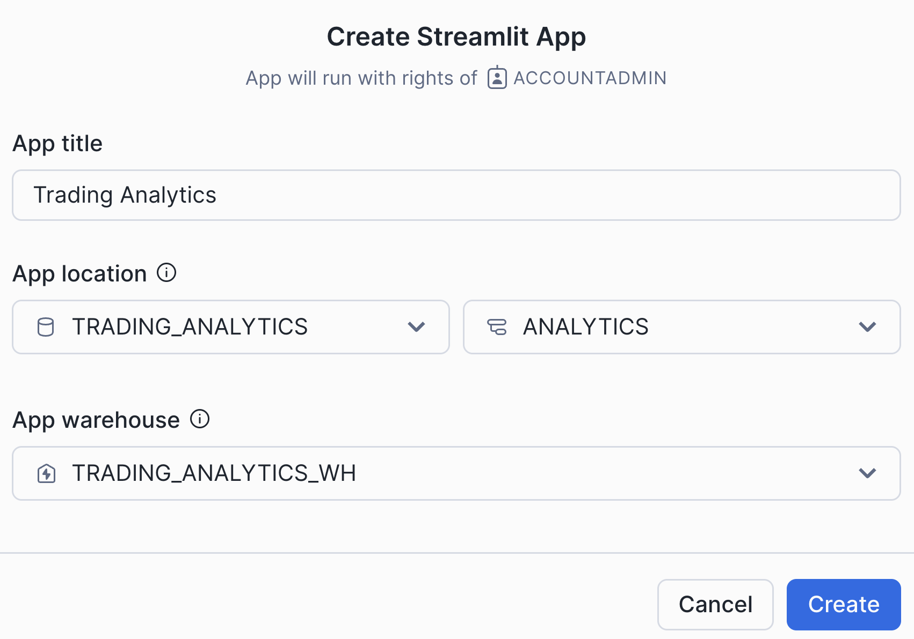

# 🚀 Trading Data Pipeline Demo

A solution using with **Snowflake**, **Python**, and **Streamlit** that shows how to load data into Snowflake from a local filesystem, process and transform this data using dynamic tables and creates interactive dashboards in Streamlit in Snowflake

## 📊 What This Demo Does

- **📥 Data Ingestion**: Load CSV files using Python containing crypto trades, user profiles, and order book data into Snowflake
- **🔄 Incremental Data Transformation**: Use Snowflake Dynamic Tables for incremental data transformation and aggregation  
- **📈 Interactive Analytics**: Visualize trading patterns, user behavior, and market insights through a Streamlit dashboard

### Data Flow
1. **Raw Layer**: CSV files uploaded to Snowflake staging area
2. **Staging Layer**: Data cleaning and standardization
3. **Analytics Layer**: Aggregated metrics via Dynamic Tables
4. **Visualization Layer**: Interactive Streamlit dashboard

## 📋 Requirements

### System Requirements
- **Python**: 3.9 or higher
- **Conda/Miniconda**: Install miniconda in your environment if you don't have yet conda/miniconda: https://www.anaconda.com/docs/getting-started/miniconda/install
- **Snowflake Account**: This will be provided

## 🚀 Quick Start

### 1. Clone the Repository
```bash
git clone https://github.com/teresanii/sf-trading-pipeline-demo.git
cd sf-trading-pipeline-demo
```

### 2. Access this Repository from the Snowflake UI

Login into your Snowflake account with the link and credentials provided.

On the top of left menu, select the plus "+" button > SQL worksheet.

Copy the contents of [`0_create_sf_git_integration.sql`](0_create_sf_git_integration.sql) to create an integration to this github repository. Click the down arrow on the top-right blue button, then select 'Run all'.

Then, from the left menu, select Projects > Workspaces > Create Workspace From Git Repository

In the popup, enter the following fields:
* Repository URL: https://github.com/teresanii/sf-trading-pipeline-demo.git
* Workspace Name: trading-pipeline-demo
* API Integration: GITHUB_INTEGRATION
* Select Public Repository

You'll see this repository inside your Snowflake Workspace!

### 3. Set Up Snowflake Objects

From your workspace, open the [`1_setup_create_snowflake_objects.sql`](1_setup_create_snowflake_objects.sql) file and run all statements to create the required objects in your account.

### 4. Set Up Local Environment

Now, go back to your terminal and setup your local environment.

```bash
# Create conda environment
conda create -n trading-pipeline-demo python=3.9 -y
conda activate trading-pipeline-demo

# Install dependencies
pip install -r requirements.txt
```

### 5. Configure Snowflake Connection

#### Edit Python Files Directly
Update the connection parameters in [`2_local_snowflake_csv_loader.py`](2_local_snowflake_csv_loader.py):
```python
conn = snowflake.connector.connect(
    user='YOUR_SNOWFLAKE_USER',
    password='YOUR_SNOWFLAKE_PASSWORD', 
    account='YOUR_SNOWFLAKE_ACCOUNT',
    warehouse='TRADING_ANALYTICS_WH',
    database='TRADING_ANALYTICS',
    schema='RAW_DATA'
)
```

### 6. Load Sample Data

Run the python script that loads the CSV files in the folder [`/sample_data/first`](sample_data/first) into your Snowflake tables by running the below.

Run the below from a terminal with the trading-pipeline-demo conda environment activated.

```bash
python 2_local_snowflake_csv_loader.py first
```
Your terminal should now display 'Data loading completed!'

Go to the Snowflake UI and check that the data was loaded. Select Data > Databases > TRADING_ANALYTICS > RAW_DATA > Tables and select any of the tables. Check the 'Data Preview' tab to confirm the data was loaded into Snowflake. 

#### Load additional data

Now, let's run the same script add more data, introduce schema changes and see the results in Snowflake.

In the [`sample_data/incremental`](sample_data/incremental) folder we have two csv files with more sample data. Check the user_profiles file to see that we introduced one additional column, optin. 

To load these additional files, run the data loader script again in your local environment with the keyword `incremental` as an argument.

```bash
python 2_local_snowflake_csv_loader.py incremental
```
Check the tables in Snowflake to see the changes were applied and additional data was loaded.

### 7. Run Data Pipeline

Back to your Snowflake account, on the top of left menu, select the plus "+" button > Notebook > Import .ipynb file. 

Select the [`4_build_sf_data_pipeline.ipynb`](4_build_sf_data_pipeline.ipynb) notebook and use the following:
* Notebook location: TRADING_ANALYTICS
* Schema: ANALYTICS
* Runtime: Run on warehouse
* Query warehouse: TRADING_ANALYTICS_WH

And hit the button ‘Create’.

Execute all cells to create Dynamic Tables and Analytics Views.

You can check your pipeline DAG in Snowsight. 

### 8. Launch Dashboard

The last step in our demo is to create a Streamlit application that will show the content of the trading data we just loaded in an interactive dashboard.

On the top of left menu, select the plus "+" button > Streamlit App > New Streamlit App. 

Create your Streamlit App with the information below: 

Under the 'Packages' menu add the latest version of the library plotly.

Replace the entire code with the contents of the file [`5_streamlit_dashboard.py`](5_streamlit_dashboard.py)

Hit 'Run' and enjoy your app!

That's it, you finished this demo!

## 📚 Additional Resources

- [Snowflake Dynamic Tables Documentation](https://docs.snowflake.com/en/user-guide/dynamic-tables-about)
- [Streamlit Documentation](https://docs.streamlit.io/)
- [Plotly Python Graphing Library](https://plotly.com/python/)
- [Snowflake Connector for Python](https://docs.snowflake.com/en/user-guide/python-connector)


